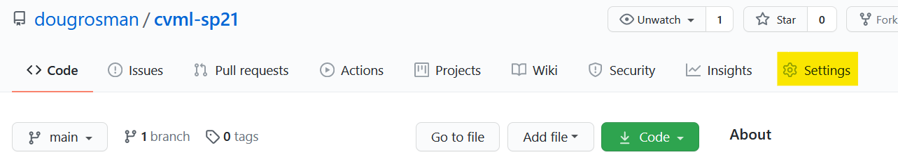
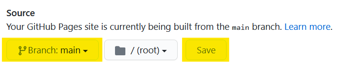
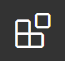
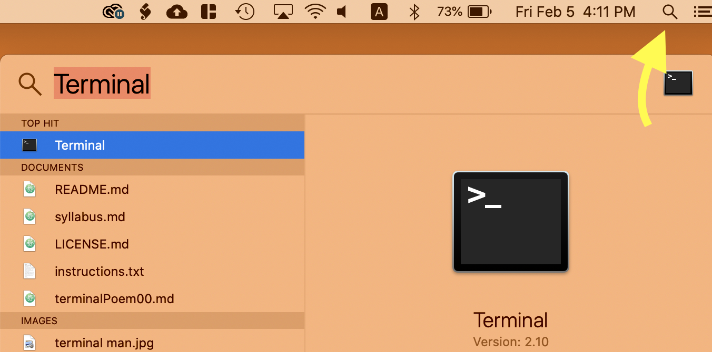

# Week 01 - 02/02/21

- [Week 01 - 02/02/21](#week-01---020221)
  - [Morning (9:30-12:30p)](#morning-930-1230p)
    - [1. Join Slack](#1-join-slack)
    - [2. Introductions](#2-introductions)
    - [3. Computer Vision: a brief introduction](#3-computer-vision-a-brief-introduction)
    - [4. Art Examples](#4-art-examples)
    - [5. AI Examples](#5-ai-examples)
    - [6. Tool Setup](#6-tool-setup)
      - [1. **GitHub**](#1-github)
      - [2. **P5.js Web Editor**](#2-p5js-web-editor)
      - [3. **Visual Studio Code (VS Code)**](#3-visual-studio-code-vs-code)
      - [4. **git**](#4-git)
      - [5. **Web Browser (Firefox or Chrome)](#5-web-browser-firefox-or-chrome)
  - [Afternoon (2:00p-5:00p)](#afternoon-200p-500p)
    - [Zoom Annotations Workshop](#zoom-annotations-workshop)
    - [In-depth guide](#in-depth-guide)
      - [Useful Links](#useful-links)
    - [Mac (coming soon)](#mac-coming-soon)
    - [Windows (coming soon)](#windows-coming-soon)

## Morning (9:30-12:30p)

[ Watch Lecture 1-1](https://www.youtube.com/watch?v=jv_p-k5fays)

### 1. Join Slack
  1. [Invite Link (only do this if you haven't already joined the workspace)](https://join.slack.com/t/cvmlsaic-sp21/shared_invite/zt-kzu1o4vp-Zry5GBpQWjBa9IBKDjZ04Q)
  2. [Link to the CVML Slack Workspace](http://cvmlsaic-sp21.slack.com/)
  3. (Recommended) Download the Desktop Slack App. You can use Slack in your browser if you'd prefer.
   
### 2. Introductions
  1. Fill out [Day 1 Survey](https://docs.google.com/forms/d/e/1FAIpQLSddOpEisL2auL8DuDzz_cYTnOvEwEUA5jdNgMLJ8OYXCYcOEg/viewform?usp=sf_link)
  2. In Zoom, set your Display name to include your preferred name, and your pronouns
  3. Make sure you receive Canvas announcement notifications to your email
  4. Meet everybody!
  5. Go over Syllabus

### 3. Computer Vision: a brief introduction
1. "Traditional" vs. Machine Learning-based Computer Vision
   1. "Traditional": writing specific algorithms "by hand" that allow a computer to parse images (like brightness thresholding, detecting edges, finding contours). Takes enormous amount of work to write effective algorithms. (For example, programming a computer to identify a dog by **describing in code** what makes a dog a dog)
   
   *Canny Edge Detection ([Wikipedia, Edge detection](https://en.wikipedia.org/wiki/Edge_detection))*
   1. Machine Learning: feeding vast amounts of data into an artificial neural network that then "learns" its own way of describing an image. Often talked about as a form of Artificial Intelligence. (For example, teaching a computer to identify a dog by **feeding it 10,000 images of dogs**, then allowing it to come up with its own description of what a dog is)
   
   *Convolutional Neural Network displaying salient features of this dog image ([ml4a, Convnet Viewer](https://ml4a.github.io/guides/ConvnetViewer/))*
   1. Both techniques are still widely used, as they're both useful for different tasks. They're frequently used together, where traditional CV approaches are used to prepare images for a data set that is then fed to a neural network.

### 4. Art Examples

*Learning to see: Gloomy Sunday - Memo Akten, 2017 [[watch on vimeo]](https://vimeo.com/260612034)*

*ImageNet Roulette - Kate Crawford, Trevor Paglen, 2019 [[article]](https://www.frieze.com/article/how-ai-selfie-app-imagenet-roulette-took-internet-storm) [[essay]](https://excavating.ai/)*

*Text Rain - Camille Utterback, Romy Achituv, 2000 [[view work]](http://camilleutterback.com/projects/text-rain/)*

### 5. AI Examples

* [AttnGAN](https://experiments.runwayml.com/generative_engine/) - Text-to-image neural network model (2017)
* [The Big Sleep](https://dank.xyz/) - Text-to-image (2020)
* [DALL·E](https://openai.com/blog/dall-e/) - OpenAI's State-of-the-Art Text to image model (2020) (Avocado chairs!!)
* [edges2cats](https://affinelayer.com/pixsrv/) - pix2pix Image-to-Image Demo
* [thispersondoesnotexist.com](https://thispersondoesnotexist.com/) - photorealistic faces of "people that don't exist" generated by Nvidia's StyleGAN2
* [thiscatdoesnotexist.com](https://thiscatdoesnotexist.com/) - same as above, but with cats

### 6. Tool Setup

#### 1. **GitHub**
   1. Create a [GitHub](https://github.com/) account (if you don't already have one)
      1. Make your username something easy to remember (it will be part of your website URL (e.g. **dougrosman**.github.io/cvml-sp21))
      2. Use your school email to sign up for an account
   2. Create a new repository for this class
      1. On [github.com](https://github.com/) Click the '+' in the upper-right of the screen and select 'Add Repository'
      2. Name your repo (something like CVML). Don't include any spaces
      3. Write a brief description
      4. Keep the Repo public
      5. **Check off 'Add a README file'** (don't forget this step!)
      6. Click the green 'Create repository' button
      7. Go to your repository settings 
      8. Scroll down almost to the bottom to the 'GitHub Pages' section
      9. Set the Source branch to 'main' and click 'Save' 
      10. After saving, the page will refresh. Scroll down to the same section again, and make note of your GitHub Pages URL. This is the link to your public website. GitHub Pages is great! Free web hosting!! (Note: this is my link, yours will have your username and repo in it) 

#### 2. **P5.js Web Editor**
   1. Create an account on [editor.p5js.org](https://editor.p5js.org/)

#### 3. **Visual Studio Code (VS Code)**
   Visual Studio Code is a *text editor*, which is a program that makes writing code easier by automating some of the repetitive parts of coding. While you may already use a text editor like Atom, Brackets or Sublime Text, I highly recommend using VS Code in this class, because it has a couple of built-in features we'll rely on to streamline our code-writing
   1. Download VS Code [here](https://code.visualstudio.com/)
   2. Follow the installation instructions (on Windows, the default options during setup are fine)
   3. Once installed, open VS Code so we can set some important preferences. Open your 'preferences' or 'settings' menu and change the following preferences. You can use the search bar to search for the preferences. 
   
      1. 'Auto Save' - set to 'afterDelay'
      2. 'Word Wrap' - set 'Editor: Word Wrap' to 'on'
      3. 'Compact Folders' - Uncheck this box
   1. Open the 'Extensions' panel 
      1. Search 'Live Server' and click 'install' next to the top result (the one created by 'Ritwick Dey')
   2. In your 'View' dropdown menu at the top of the screen, uncheck 'Show Minimap' 

#### 4. **git**
   1. **Mac:**
      1. Open your Terminal (you can use Spotlight Search) 
      2. In your Terminal, copy and paste `git --version` and then press 'Return'
      3. If you see a version number, then git is already installed. If you don't, then a dialog window will pop up asking you if you would like to install some tools. Select 'Yes' or whatever it says in each dialog box to install **git** on your system.
   2. **Windows:**
      1. Download the correct version [here](https://git-scm.com/downloads).
      2. Run the installer. The default settings are fine, you can click 'next' for each of the pages you encounter.

#### 5. **Web Browser (Firefox or Chrome)
In this class, please be sure to only use Mozilla Firefox or Google Chrome. I prefer Firefox for a number of reasons, but Chrome often performs faster with graphics content than Firefox, so it's up to you depending on the needs of your art. Please do not use Safari or Edge.

## Afternoon (2:00p-5:00p)
[ Watch Lecture 1-2](https://www.youtube.com/watch?v=tw-3QEblSGI)

### Zoom Annotations Workshop
In this workshop, we'll be diving in to coding and machine learning head first! This workshop will require a lot of steps, but we can all get through it together. And don't worry, even if some of what we do today feels really challenging, we'll be starting more from the beginning next week.

This workshop is inspired (or rather, *shamelessly stolen*) from Dan Shiffman's Coding Train YouTube channel. You can watch that video here: [Coding Challenge #157: Zoom Annotations with Machine Learning + p5.js](https://www.youtube.com/watch?v=9z9mbiOZqSs). This video covers everything we did in class in about 20 minutes. Since he takes for granted that you might already know a little bit about teachable machine and p5.js, the video goes by pretty quickly. He also doesn't spend much time dealing with the various OBS virtual webcam issues we were working out in class together.

If you feel pretty comfortable with what we did in the workshop, but want to go back and review it without having to wade through a 2.5 hour lecture, I highly recommend Dan Shiffman's video.

If you're still having issues with OBS and other webcam-related things, I recommend going back through this lecture to find the parts that help you out.

I will also write out detailed step-by-step instructions below, beginning with **downloading and installing OBS**, and finishing with **displaying your interactive Zoom Annotations through Zoom!**

### In-depth guide
(*Note: I plan to fill this out with more information, but I've started with an outline of all the steps. You can always revisit the lecture recordings*)

I've decided to split this up into two separate sections: Mac and Windows. There's plenty of overlap, but I think it'll be easier if they're separate. First, some quick, useful links:

#### Useful Links
1. [Download and Install OBS](https://obsproject.com/) (If you already have it, make sure you update it to the latest version at least version 26.1.1)
2. [Download and Install ManyCam](https://manycam.com/) (Windows Only)
3. [My completed p5.js code](https://editor.p5js.org/drosman-cvml/sketches/tKPeovVJz) - Open this up, and then go to 'File-->Save'. This will save a copy of this code to your p5.js account, which you can then continue to edit. (make sure to swap out my Teachable Machine Model link with your own at line 15 in th code)
4. [Teachable Machine](https://teachablemachine.withgoogle.com/) - For this exercise, we created an 'Image Model'
5. [Coding Challenge #157: Zoom Annotations with Machine Learning + p5.js](https://www.youtube.com/watch?v=9z9mbiOZqSs) - Dan Shiffman's original video for this workshop. **This is probably the quickest way to get back into working on this stuff.**

### Mac (coming soon)

### Windows (coming soon)