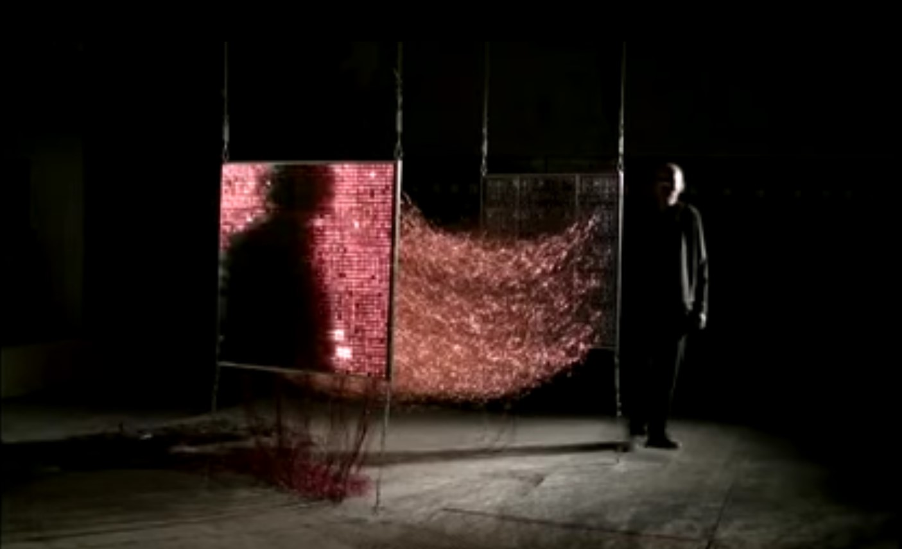

# Week 02 - 02/09/21 - Image Processing and "Mirrors"

##### Agenda
1. Good morning!
2. Look at art, things happening in the world
3. Lecture: History of computer vision
4. Look at some "trad" computer vision art
5. Talk about project scope, what we are capable of. Thinking idea and affect first, technology second. Even if the technology is the content of your work.
6. Coding workshop part 1: setting up tools, various p5.js sketches to introduce pixel manipulation basics
- Break
1. Good afternoon!
2. Coding workshop: Rozin Mirrors
3. Go over GitHub/fullscreen/responsive rozin mirrors
4. Homework:
   1. post your rozin mirror to your github so that it is full screen and responsive (we will go over this in class)
   2. Read the following Golan Levin essays: 
5. Homework:

Exercise thoughts:
1. thinking pixel-to-X (light and subject as input, pixel manipulation as output)
2. Always thinking about input-ouput relationships. Computer vision tools are a means to an end. Computer vision can be a means towards translating the human/immaterial/unquantifiable into the digital/quantifiable/
3. How do we address "idea-first" thinking when optimization/technical limitations enter the process.

[pointerpointer.com](https://pointerpointer.com/)

### CV
[Early Days of Computer Vision (60s)](https://www.youtube.com/watch?v=gaQi26FbK4k)

[Computer Vision vs Image Processing](https://www.youtube.com/watch?v=9-8Js62wzQs) [note: in general, "computer vision" is about understanding the world. Image processing is an important part of computer vision, but it's not the whole story.]

[How a CMOS-Sensor in a Camera Works](https://www.youtube.com/watch?v=oa2DbQcKAEU)

### Art

- [A Parallel Image](https://www.youtube.com/watch?v=g5cIVq-l12I) - Gebhard Sengmüller (2008)

*Description of 'A Parallel Image' by Gebhard Sengmüller*
- [Surface Tension](https://www.lozano-hemmer.com/surface_tension.php) - Rafael Lozano-Hemmer (1992)
- [Standards and Double Standards](https://www.lozano-hemmer.com/standards_and_double_standards.php) - Rafael Lozano-Hemmer (2004)

- [Drawing With Sound](https://annaridler.com/drawing-with-sound) - Anna Ridler (2017)****

#### Daniel Rozin (Mirrors)
[Daniel Rozin Interview (2019)](https://www.youtube.com/watch?v=kV8v2GKC8WA)
[Daniel Rozin's Website](https://www.smoothware.com/danny/)

##### Software Mirrors
* [Mirror No. 5 (2001)](https://vimeo.com/32462252)
* [Darwinian Straw Mirror](https://vimeo.com/129686860)
* [Bitforms Vimeo Channel](https://vimeo.com/bitforms)

## Code
### p5.js sketches
0. Coding review: Nested for-loop (filling the canvas)
1. Coding review: arrays
2. Pixel access (x + (y*width))
3. Pixel access - image
4. Pixel access - webcam
5. Brightness threshold
6. Rozin mirror