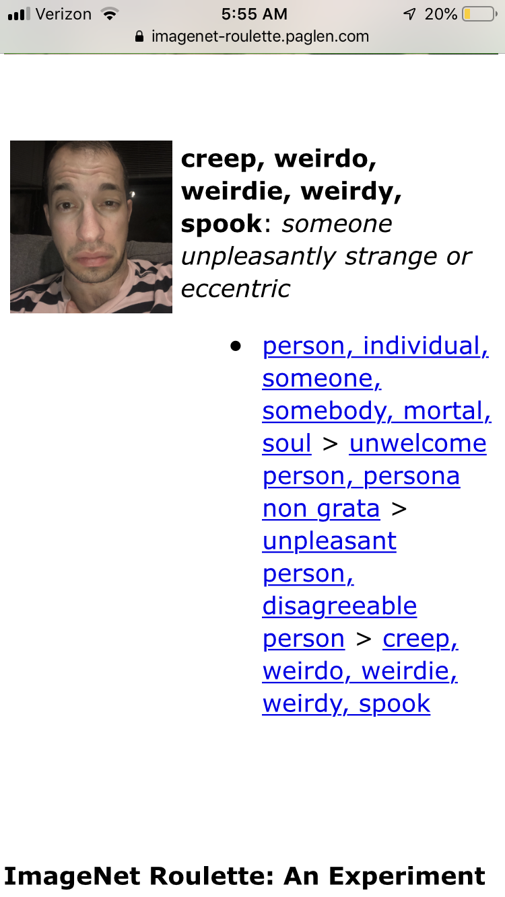
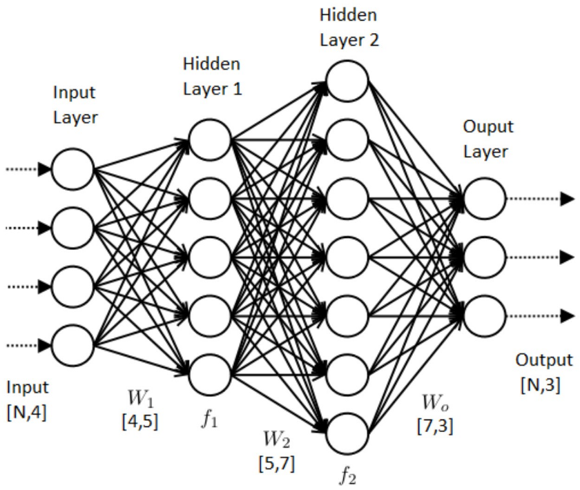
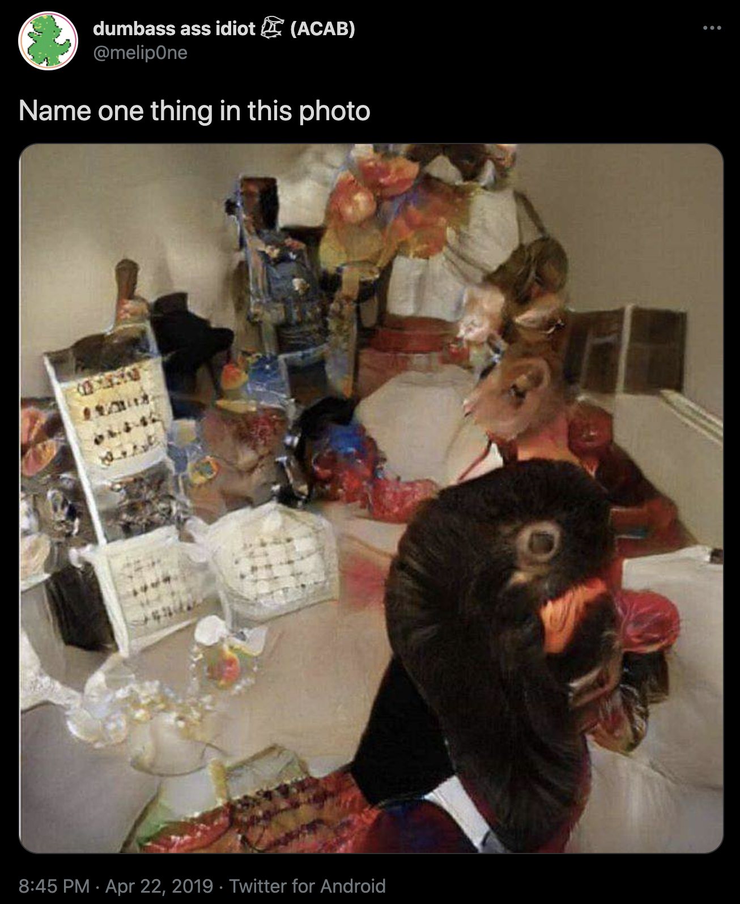
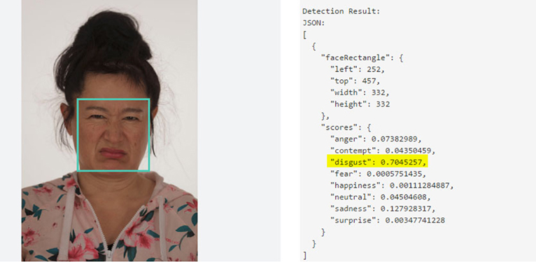
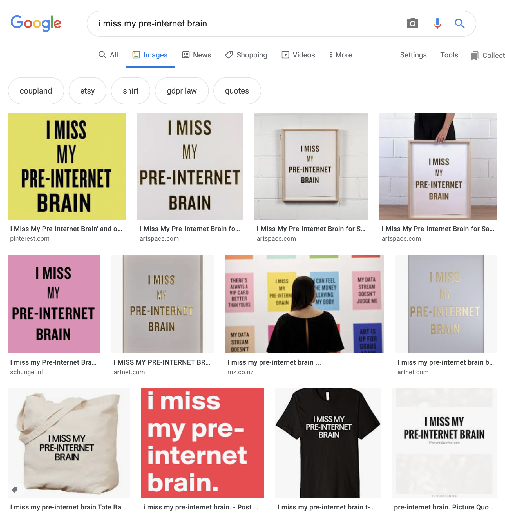
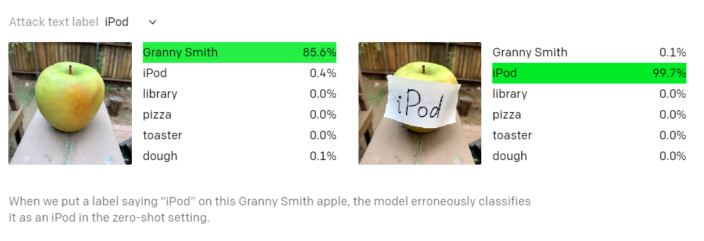

### Neural Nets and Data 
##### March 16, 2021
###### Table of Contents
- [Doug](#doug)
- [Doog](#doog)
- [Surveillance Capitalism](#surveillance-capitalism)
- [AI / Machine Learning / Neural Networks](#ai--machine-learning--neural-networks)
    - [Explanatory](#explanatory)
    - [Data sets](#data-sets)
    - [Wow! Vertigo!](#wow-vertigo)
- [AI In the Wild](#ai-in-the-wild)
- [AI + Art](#ai--art)
- [AI Bias // AI Error // Ethics+Implications](#ai-bias--ai-error--ethicsimplications)
    - [GPT-3](#gpt-3)
    - [Other infractions](#other-infractions)
- [What can we do?](#what-can-we-do)
- [Recommendations](#recommendations)
    - [Tools](#tools)
    - [Collections](#collections)
    - [Teach yourself AI](#teach-yourself-ai)
    - [Podcasts](#podcasts)
    - [Further Reading/Watching](#further-readingwatching)

<video src="video/treadmill.mp4" controls></video>

## Doug

* [@thedougrosmanstory](https://www.instagram.com/thedougrosmanstory/)
* [dougrosman.com](https://dougrosman.com/)
* [imin [a box]](https://dougrosman.com/imin/) (2014)
* [I don't have you but you've still got my heart](https://dougrosman.com/i-dont-have-you/) (2018)
* [Cosmic Author](https://dougrosman.com/cosmic-author/) (2018)
* [Patriot Coin](https://dougrosman.github.io/PatriotCoin/) (Proof of Concept) (note: you need a [MetaMask](https://metamask.io/) account and browser plugin to interact with this site. This site uses the Rinkeby TestNet.

## Doog
* [self-contained](https://dougrosman.com/self-contained-ii/) (2019-ongoing)

Still from _[self-contained](https://dougrosman.com/self-contained-ii/)_ (2019) 

<iframe src="https://player.vimeo.com/video/515276190?badge=0&amp;autopause=0&amp;player_id=0&amp;app_id=58479" width="560" height="315" frameborder="0" allow="autoplay; fullscreen; picture-in-picture" allowfullscreen title="self-contained || Doug Rosman || Trailer"></iframe>

* [Data Doppelgängers and the Uncanny Valley of Personalization](https://www.theatlantic.com/technology/archive/2014/06/data-doppelgangers-and-the-uncanny-valley-of-personalization/372780/)
* _Glitch manifests with such variance, generating ruptures between the recognized and recognizable, and amplifying within such ruptures, extending them to become fantastic landscapes of possibility. It is here where we open up the opportunity to recognize and realize ourselves, “reflecting]” to truly see one another as we move and modify_ – Glitch Feminism (p. 25)
* _Thus glitch feminism gives weight to the selves we create through the material of the Internet_ (p. 43)
* _Writer, poet, phiolospher and critic Edouard Glissant deines diaspora as "the passage from unity to multiplicity," exploring these "departure[s]" within a selfdom as being plausible only when "one consents not to be a single being and attempts to be many beings at the same time." (p. 46)

* [Database rabbit hole...](https://machine-vision.no/machine-vision-situation/machine-readable-hito-analysing-hito)

## Surveillance Capitalism
[The Age of Surveillance Capitalism](https://www.goodreads.com/book/show/26195941-the-age-of-surveillance-capitalism) (2019) – Shoshana Zuboff
**Surveillance Capitalism is:**
1. A new economic order that claims human experience as free raw material for hidden commercial practices of extraction, prediction, and sales;
2. A parasitic economic logic in which the production of goods and services is subordinated to a new global architecture of behavioral modification;
3. A rogue mutation of capitalism marked by concentrations of wealth, knowledge, and power unprecedented in human history;
4. The foundational framework of a surveillance economy;
5. As significant a threat to human nature in the twenty-first century as industrial capitalism was to the natural world in the nineteenth and twentieth
6. The origin of a new instrumentarian power that asserts dominance over society and presents startling challenges to market democracy;
7. A movement that aims to impose a new collective order based on total certainty;
8. An expropriation of critical human rights that is best understood as a coup from above: an overthrow of the people’s sovereignty.

* It’s easier to capture and store ALL your data than it is to determine and capture only what is considered “useful.” (especially since what might not be useful now may someday become useful)
* We can be connected and compared to each other in ways that defy human language.

* [No boundaries: Exfiltration of personal data by session-replay scripts](https://freedom-to-tinker.com/2017/11/15/no-boundaries-exfiltration-of-personal-data-by-session-replay-scripts/)
* [NYTimes: Location Tracking](articles/Your-Apps-Know-Where-You-Were-Last-Night-and-Theyre-Not-Keeping-It-Secret.html)
* [NYTimes: ClearView](https://www.nytimes.com/2020/01/18/technology/clearview-privacy-facial-recognition.html)
* [NYTimes: Before Clearview Became a Police Tool, It Was a Secret Plaything of the Rich](https://www.nytimes.com/2020/03/05/technology/clearview-investors.html)
* [Facebook Isn’t Recording Your Conversations, But It May as Well Be](https://lifehacker.com/facebook-isn-t-recording-your-conversations-but-it-may-1820193946)
* [Facebook Knows How to Track You Using the Dust on Your Camera Lens](https://gizmodo.com/facebook-knows-how-to-track-you-using-the-dust-on-your-1821030620)
* [Facebook Figured Out My Family Secrets, And It Won't Tell Me How](https://gizmodo.com/facebook-figured-out-my-family-secrets-and-it-wont-tel-1797696163)
* [Target + Big Data + Pregnancy Predictions](https://slate.com/human-interest/2014/06/big-data-whats-even-creepier-than-target-guessing-that-youre-pregnant.html), 
* [How Target Figured Out A Teen Girl Was Pregnant Before Her Father Did](https://www.forbes.com/sites/kashmirhill/2012/02/16/how-target-figured-out-a-teen-girl-was-pregnant-before-her-father-did)
* [The ‘ghost work’ powering tech magic](https://www.bbc.com/worklife/article/20190829-the-ghost-work-powering-tech-magic)
* [Ben Grosser – _Order of Magnitude_ (2019)](https://bengrosser.com/projects/order-of-magnitude/)
* [Seven on Seven 2016: Miranda July & Paul Ford](https://vimeo.com/167171454)
* [WHITE COLLAR CRIME RISK ZONES](https://whitecollar.thenewinquiry.com/)

## AI / Machine Learning / Neural Networks

[Name one thing in this photo](https://twitter.com/melip0ne/status/1120503955526750208)

#### Explanatory
* [Convolutional Network MNIST Demo](https://www.cs.ryerson.ca/~aharley/vis/conv/)
* [Image Classifier Demo](https://codesandbox.io/s/z364noozrm)
* [Convnet Explanation video 1](https://www.youtube.com/watch?v=YRhxdVk_sIs) (deep lizard)
* [Convnet Explanation video 2](https://youtu.be/FmpDIaiMIeA?t=102) (Brandon Rohrer)
* [Simple Introduction to Convolutional Neural Networks](https://towardsdatascience.com/simple-introduction-to-convolutional-neural-networks-cdf8d3077bac)

[GANs explained](https://www.youtube.com/watch?v=Sw9r8CL98N0) (Computerphile)

#### Data sets
* [imageNet Wikipedia](https://en.wikipedia.org/wiki/ImageNet#Bias_in_ImageNet)
* [imageNet Site](http://www.image-net.org/)
* [Kaggle.com (publicly available datasets and data science bounties)](https://kaggle.com)

<video src="video/xray-latent-0.9.mp4" controls></video>
<video src="video/xray-latent-1.2.mp4" controls></video>
 
_Latent space traversal of a StyleGAN2 model trained on Chest XRAY dataset found on Kaggle.com_

#### Wow! Vertigo!
<iframe src="https://player.vimeo.com/video/260612034" width="640" height="360" frameborder="0" allow="autoplay; fullscreen; picture-in-picture" allowfullscreen></iframe>

[Learning to see: Gloomy Sunday](http://www.memo.tv/works/gloomy-sunday/) – Memo Akten

* [StyleGAN2](https://youtu.be/c-NJtV9Jvp0?t=120)
  * [StyleGAN2 GitHub Repo](https://github.com/NVlabs/stylegan2)
* [DALL·E](https://openai.com/blog/dall-e/)
* [Tom Cruise Deepfake](https://www.youtube.com/watch?v=iyiOVUbsPcM)
* [This Cat Does Not Exist](https://thiscatdoesnotexist.com/)
* [Edges2Cats](https://affinelayer.com/pixsrv/)
* [This Person Does Not Exist](https://www.thispersondoesnotexist.com/)
* [Subvocalizations to Text](https://www.youtube.com/watch?v=RuUSc53Xpeg&list=PLVFnIENoSt3hQFM4a6Kw1wq-ltCrq8bIL&index=3)
* [Subreddit Simulator](https://www.reddit.com/r/SubSimulatorGPT2/top/?t=all)
* [Pouff - Grocery Trip (Deep Dream)](https://www.youtube.com/watch?v=DgPaCWJL7XI)

<iframe width="560" height="315" src="https://www.youtube.com/embed/Sr2ga3BBMTc?t=57" frameborder="0" allow="accelerometer; autoplay; clipboard-write; encrypted-media; gyroscope; picture-in-picture" allowfullscreen></iframe>

[Can an AI Design our Tax Policy?](https://youtu.be/Sr2ga3BBMTc?t=57) (2020) – Two Minute Papers

[Two minute papers - Mind reading for brain-to-text communication (redesign alphabet)](https://youtu.be/IUg-t609byg?t=217)

_"So here, in goes the brain activity, and out comes the decision that says which character these activities correspond to. Of course, our alphabet was not designed to be decoded with neural networks. So here is an almost science-fiction-like question: how do we reformulate the alphabet to tailor it to maximize the efficiency of a neural network decoding our thoughts? Or, simpler, what would the alphabet look like if the neural networks were in charge?"_

* [End-to-End Deep Image Reconstruction From Human Brain Activity](https://www.frontiersin.org/articles/10.3389/fncom.2019.00021/full)

## AI In the Wild

<video src="video/demon.mp4" controls></video>

* [FaceApp](https://www.faceapp.com/)
* [Portrait AI](https://portraitai.com/)
* [Wambo.ai](https://www.insider.com/wombo-ai-womboai-download-transforms-photo-a-singing-deepfake-face-2021-3) (download the app)
* [Deep Nostalgia - myheritage.com](https://www.theverge.com/2021/2/28/22306097/ai-brings-still-photos-life-meme-twitter-geneaology-myheritage)
* [Artbreeder](https://www.artbreeder.com/)

## AI + Art

[Machine-readable Hito](https://www.fastcompany.com/90139345/this-is-what-machines-see-when-they-look-at-us)

<iframe width="560" height="315" src="https://www.youtube.com/embed/CjB6DQGalU0" frameborder="0" allow="accelerometer; autoplay; clipboard-write; encrypted-media; gyroscope; picture-in-picture" allowfullscreen></iframe>

* [Every piece of art you've ever wanted to see — up close and searchable – Amit Sood](https://www.youtube.com/watch?v=CjB6DQGalU0) (2016) – Google Arts and Culture Ted Talk
  * _"So take out your phones, take out your computers, go visit museums...the least we can do is get our daily dose of art and culture for ourselves and our kids"_
  * [Google Arts and Culture TSNE map](https://artsexperiments.withgoogle.com/tsnemap)
  * [X Degrees of Separation](https://artsexperiments.withgoogle.com/xdegrees/) (2018) - Google Arts and Culture Experiment, Mario Klingemann & Simon Doury

## AI Bias // AI Error // Ethics+Implications
<iframe width="560" height="315" src="https://www.youtube.com/embed/HZxV9w2o0FM" frameborder="0" allow="accelerometer; autoplay; clipboard-write; encrypted-media; gyroscope; picture-in-picture" allowfullscreen></iframe>

[Joy Buolamwini, “AI, Ain’t I a Woman?” // Vision & Justice // Radcliffe Institute](https://www.youtube.com/watch?v=HZxV9w2o0FM)

<video src="video/ai_camera_soccer_ball.mp4" controls></video>

[AI camera operator repeatedly confuses bald head for soccer ball during live stream](https://www.theverge.com/tldr/2020/11/3/21547392/ai-camera-operator-football-bald-head-soccer-mistakes)

* [Chinese businesswoman accused of jaywalking after AI camera spots her face on an advert](https://www.telegraph.co.uk/technology/2018/11/25/chinese-businesswoman-accused-jaywalking-ai-camera-spots-face/)

#### GPT-3
* [I'm shocked how hard it is to generate text about Muslims from GPT-3 that has nothing to do with violence... or being killed...](https://twitter.com/abidlabs/status/1291165311329341440)
<video src="video/gpt3_muslim.mp4" controls></video>

* [gpt-3 follows its car battery wisdom with a series of sexist jokes about women because of course it does.](https://twitter.com/JanelleCShane/status/1366095485862350850)
* [gpt3 is surprising and creative but it’s also unsafe due to harmful biases. Prompted to write tweets from one word - Jews, black, women, holocaust](https://twitter.com/an_open_mind/status/1284487376312709120)

#### Other infractions
* [Voice Recognition Systems Seem To Make More Errors WIth Women's Dictation](https://www.sciencedaily.com/releases/2007/05/070504133050.htm)
* [Racist Soap Dispenser](https://twitter.com/nke_ise/status/897756900753891328)
* [Apple Refunds Device That Can't Tell Chinese People Apart](https://www.newsweek.com/iphone-x-racist-apple-refunds-device-cant-tell-chinese-people-apart-woman-751263)
* [AI can guess whether you're gay or straight from a photograph](https://www.theguardian.com/technology/2017/sep/07/new-artificial-intelligence-can-tell-whether-youre-gay-or-straight-from-a-photograph)
  * [The infamous AI gaydar study was repeated – and, no, code can't tell if you're straight or not just from your face](https://www.theregister.com/2019/03/05/ai_gaydar/)
    * "Even if they don't work, there is a possibility that they might be used to generate fear," he said. "If they do work they can be used in very horrible ways."
    * "What it tells us is that there might be information in the images predictive of sexual orientation that we didn't expect, such as brighter images for one of the groups, or more saturated colors in one group."
* ["Racist" Government Passport System Rejects Black Man's Photo Despite Meeting All Criteria](https://www.diyphotography.net/racist-government-passport-system-rejects-black-mans-photo-despite-meeting-all-criteria/)
* [A Simple Sticker Tricked Neural Networks Into Classifying Anything as a Toaster](https://gizmodo.com/this-simple-sticker-can-trick-neural-networks-into-thin-1821735479)
* [One-pixel attack](https://github.com/Hyperparticle/one-pixel-attack-keras)
* [Multimodal Neurons in Artificial Neural Networks (Typographic attack)](https://openai.com/blog/multimodal-neurons/)

* [MIT Moral Machine](http://moralmachine.mit.edu/)
* [Gender Classifier Tutorial](https://www.youtube.com/watch?v=kOymVLU9Ws8)
* [Tyler Vigen - _Spurious Correlations_](https://www.tylervigen.com/spurious-correlations)

## What can we do?
<video src="video/scams.mp4" controls></video>
"apparently when you're an adult, everybody is trying to scam you, and everything is just about trying not to get scammed"

## Recommendations
#### Tools
* [flowchart.fun](https://flowchart.fun/)

#### Collections
* [aiartists.org](https://aiartists.org/)
* [Google Experiments](https://experiments.withgoogle.com/)
* [Google Experiments AI Collection](https://experiments.withgoogle.com/collection/ai)
* [Two Minute Papers](https://www.youtube.com/user/keeroyz) – YouTube channels, summarizes cutting edge research papers in AI, Simulation, and Computer Graphics
* [The New Aesthetic](https://new-aesthetic.tumblr.com/) (James Bridle's Tumblr)

#### Teach yourself AI
* [Artificial Images](https://www.youtube.com/channel/UCaZuPdmZ380SFUMKHVsv_AA) (YouTube Channel) - Derrick Schultz is an artist creating video lectures and tutorials showing how to train your machine learning models to generate imagery.
* [Machine Learning for Artists (ml4a)](https://ml4a.github.io/) – Gene Kogan's Collection of ML resources for artists for artists
* [The Neural Aesthetic](https://ml4a.github.io/classes/itp-F18/) – Gene Kogan's Fall 2018 class at NYU on AI and image-making
* [Beginner's Guide to Machine Learning in JavaScript](https://www.youtube.com/watch?v=26uABexmOX4&list=PLRqwX-V7Uu6YPSwT06y_AEYTqIwbeam3y) (The Coding Train YouTube Channel) – Dan Shiffman shows how to make interactive sketches in your browser using p5.js and ml5.js
* [ml5.js](https://learn.ml5js.org/#/) – A JavaScript library for doing machine learning in the Browser
* [Teachable Machine](https://teachablemachine.withgoogle.com/) – Created by Google, a quick and easy-to-use browser tool for training your own machine learning model (image classificaton, pose recognition, audio classification)
* [RunwayML](https://runwayml.com/) - Play around with a ton of different Machine Learning models in your browser
  * [Runway: Machine Learning for Creators](https://www.youtube.com/watch?v=ARnf4ilr9Hc&list=PLRqwX-V7Uu6aBhR9QrBIsyybrnK7MCcYU) – Coding Train Video Tutorials

#### Podcasts
* [Memes as Politics](https://podcasts.apple.com/us/podcast/joshua-citarella/id1513817688) - Joshua Citarella
* [New Models Podcast](https://podcasts.apple.com/us/podcast/new-models-podcast/id1399619562) // [newmodels.io](https://newmodels.io/)
* [Interdependence Podcast](https://interdependence.fm/)

#### Further Reading/Watching
* [Excavating AI: The Politics of Images in Machine Learning Training Sets](https://excavating.ai/) (2020) – Kate Crawford and Trevor Paglen
  * [Online Database ImageNet to Remove 600,000 Images After Art Project Exposes Its Racist and Gender Bias](https://www.diyphotography.net/online-database-imagenet-to-remove-600000-images-after-art-project-exposes-its-racist-and-gender-bias/)
* [Invisible Images (Your Pictures Are Looking at You)](https://thenewinquiry.com/invisible-images-your-pictures-are-looking-at-you/) (2016) – Trevor Paglen
* [Coded Bias Documentary](https://www.codedbias.com/) (available on Panopto)
* [The Building Blocks of Interpretability](https://distill.pub/2018/building-blocks/)